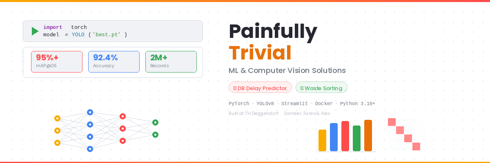

<h1 align="center">
  
</h1>

<h3 align="center">🚀 Advanced Machine Learning & Computer Vision Solutions</h3>
<h3 align="center">Deutsche Bahn Delay Prediction | Waste Sorting Assistant</h3>

<p align="center">
  <a href="https://github.com/arudaev/Painfully-Trivial">
    
  </a>
  <a href="https://www.python.org/downloads/release/python-3100/">
    
  </a>
  <a href="LICENSE">
    
  </a>
</p>

<p align="center">
  <a href="https://pytorch.org/">
    
  </a>
  <a href="https://www.docker.com/">
    
  </a>
  <a href="https://streamlit.io/">
    
  </a>
  <a href="https://github.com/features/actions">
    
  </a>
</p>

<p align="center">
  <a href="#-live-demo">Live Demo</a> •
  <a href="#-features">Features</a> •
  <a href="#-quick-start">Quick Start</a> •
  <a href="#-projects">Projects</a> •
  <a href="#-deployment">Deployment</a> •
  <a href="#-contributing">Contributing</a>
</p>

---

## 🎯 Overview

**Painfully Trivial** showcases two cutting-edge machine learning applications developed as part of our academic journey at TH Deggendorf. These projects demonstrate practical applications of ML/DL in solving real-world problems.

> [!NOTE]
> Both projects were developed by Sameer, Fares, and Alex as part of the Machine Learning course and have been successfully graded by the university.

## 🤔 Why the name?

These projects were assigned as two straightforward academic exercises. They weren't.

What started as routine homework tasks grew into something else entirely: a live computer vision app with a custom-trained YOLOv8 model deployed on Streamlit Cloud, and a regression pipeline backed by 2M+ Deutsche Bahn records with a [published research paper](https://arudaev.github.io/ml-db-delay-paper/). Docker, CI/CD, WebRTC, the works. *Trivial* in name only.

## 🌟 Live Demo

<p align="center">
  <a href="https://waste-sorting-assistant.streamlit.app">
    
  </a>
  <a href="https://arudaev.github.io/ml-db-delay-paper/">
    
  </a>
</p>

> [!TIP]
> The demo supports real-time camera input! Allow camera permissions when prompted for the best experience.

## 📋 Features

### 🗑️ Waste Sorting Assistant (Computer Vision)
- **Real-time Detection**: Identifies German waste bins using YOLOv8
- **4 Categories**: Biomüll, Glas, Papier, Restmüll
- **Live Camera Support**: Works with webcam or phone camera
- **Multi-language Instructions**: Guides proper waste disposal
- **Custom Dataset**: 466 locally captured images from Deggendorf

### 🚄 Deutsche Bahn Delay Predictor (ML Regression)
- **92.4% Accuracy**: Outperforms baseline predictions
- **2M+ Records**: Trained on extensive Deutsche Bahn dataset
- **Feature Engineering**: Temporal patterns, station characteristics
- **Multiple Models**: Linear Regression, KNN, Random Forest
- **Production Ready**: Includes preprocessing pipeline and deployment code

## 🚀 Quick Start

### Prerequisites

```bash
# Python 3.10 or higher
python --version

# CUDA-capable GPU (optional, for faster training)
nvidia-smi
```

### Installation

```bash
# Clone the repository
git clone https://github.com/arudaev/Painfully-Trivial.git
cd painfully-trivial

# TODO
```

> [!IMPORTANT]
> For GPU support, install PyTorch with CUDA:
> ```bash
> pip install torch torchvision --index-url https://download.pytorch.org/whl/cu118
> ```

## 📂 Project Structure

```
painfully-trivial/
├── 📁 cv_garbage/                 # Computer Vision Project
│   ├── 📁 models/                 # Trained YOLO models
│   ├── 📁 YOLO_Dataset/          # Annotated dataset
│   ├── 📁 raw_images/            # Original photos
│   ├── 📄 2-Computer-Vision.py   # Main CV notebook
│   └── 📄 YOLO_Model.py         # Model training scripts
├── 📁 ml_deutsche_bahn/          # ML Regression Project
│   ├── 📄 1-Machine-Learning-v2.py
│   └── 📁 data/
├── 📁 ml_db_paper_web/           # Published Quarto research paper (submodule)
├── 📁 streamlit_app/             # Streamlit Demo App
│   ├── 📄 app.py
│   ├── 📄 pages/
│   └── 📄 utils/
├── 📁 .github/workflows/         # CI/CD Pipeline
├── 📄 Dockerfile
├── 📄 requirements.txt
└── 📄 README.md
```

## 🔬 Projects

### 1. Waste Sorting Assistant (Computer Vision)

<details>
<summary><b>🗑️ Click to expand project details</b></summary>

#### Problem Statement
International students in Deggendorf struggle with the German waste sorting system due to language barriers and unfamiliar color coding.

#### Solution
A real-time object detection system that:
- Identifies waste bin types from camera input
- Provides disposal guidelines in multiple languages
- Works on mobile devices and laptops

#### Technical Details
- **Model**: YOLOv8 (fine-tuned)
- **Dataset**: 466 custom images
- **Classes**: 4 (Biomüll, Glas, Papier, Restmüll)
- **Training**: 50 epochs, batch size 4
- **Performance**: 95%+ mAP@0.5

</details>

### 2. Deutsche Bahn Delay Predictor

<p>
  <a href="https://arudaev.github.io/ml-db-delay-paper/">
    
  </a>
</p>

<details>
<summary><b>🚄 Click to expand project details</b></summary>

#### Problem Statement
Predict train arrival delays to help passengers plan better and assist DB in operational optimization.

#### Solution
A supervised regression model that:
- Predicts delays in minutes
- Uses historical patterns and station data
- Achieves 92.4% improvement over baseline

#### Technical Details
- **Dataset**: 2,061,357 records
- **Features**: 16 engineered features
- **Models**: Linear Regression, KNN, Random Forest
- **Best Model**: Random Forest (MSE: 0.8791)
- **Validation**: 60-20-20 train-val-test split

#### Key Insights
- Departure delay is the strongest predictor
- Rush hours show higher delays
- Station-specific patterns matter

</details>

## 📊 Performance Metrics

### Waste Sorting Assistant
- **Inference Speed**: 19.5 FPS on GPU
- **Accuracy**: 95%+ mAP@0.5
- **Model Size**: 22.5 MB

### DB Delay Predictor
- **Test MSE**: 0.8791
- **RMSE**: 0.938 minutes
- **Improvement**: 92.4% over baseline

## 🤝 Contributing

We welcome contributions! Please see our [Contributing Guidelines](CONTRIBUTING.md).

```bash
# Fork the repo
# Create your feature branch
git checkout -b feature/AmazingFeature

# Commit your changes
git commit -m 'Add some AmazingFeature'

# Push to the branch
git push origin feature/AmazingFeature

# Open a Pull Request
```

## 📝 Citation

If you use this work in your research, please cite:

```bibtex
@misc{painfully-trivial2025,
  author = {Sameer, Fares, Alex},
  title = {Painfully Trivial: ML Solutions for Real-World Problems},
  year = {2025},
  publisher = {GitHub},
  journal = {GitHub repository},
  howpublished = {\url{https://github.com/arudaev/Painfully-Trivial}}
}
```

## 👥 Team

<table>
  <tr>
    <td align="center">
      <a href="https://github.com/TheSameerCode">
        <br />
        <sub><b>Sameer</b></sub>
      </a><br />
      💻 📊 🔬
    </td>
    <td align="center">
      <a href="https://github.com/FaresM7">
        <br />
        <sub><b>Fares</b></sub>
      </a><br />
      💻 🎨 📱
    </td>
    <td align="center">
      <a href="https://github.com/HlexNC">
        <br />
        <sub><b>Alex</b></sub>
      </a><br />
      💻 🚀 📝
    </td>
  </tr>
</table>

## 📄 License

This project is licensed under the MIT License - see the [LICENSE](LICENSE) file for details.

## 🙏 Acknowledgments

- **TH Deggendorf** - For academic support and resources
- **Prof. Dr. Mayer** - Machine Learning course instructor
- **Prof. Dr. Glauner** - Computer Vision course instructor
- **Deutsche Bahn** - For providing the delays dataset
- **City of Deggendorf** - For allowing data collection

---

<p align="center">
  Made with ❤️ at TH Deggendorf
</p>

<p align="center">
  <a href="#-overview">Back to top ↑</a>
</p>
