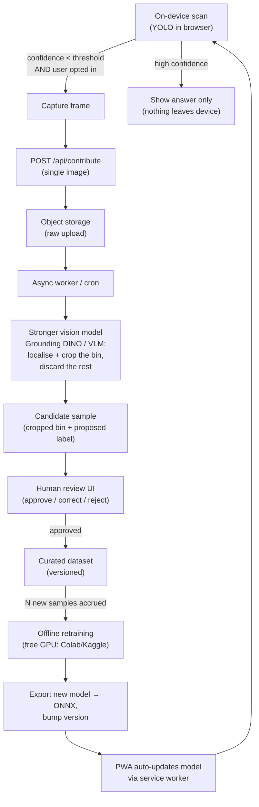
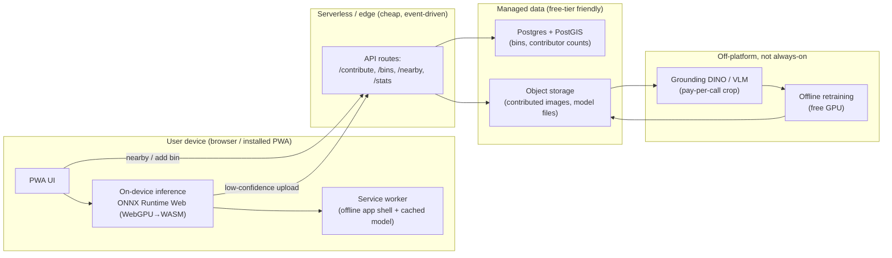

# Smart Bin Recognition — Project Proposal

**A privacy-first, self-improving Progressive Web App that helps people in Deggendorf recognise waste bins, learn what belongs in them, and find the nearest bin they need.**

| | |
|---|---|
| **Working title** | Smart Bin Recognition (Deggendorf) |
| **Proposed by** | Team Painfully Trivial — Sameer, Fares, Alex (TH Deggendorf) |
| **Status** | Draft proposal for review by the City of Deggendorf and TH Deggendorf |
| **Builds on** | *Waste Sorting Assistant* (YOLOv8, in the `Painfully-Trivial` repo) |
| **Target repository** | `smart-bin-recognition` (new, standalone) |
| **Date** | 2026-07-22 |

---

## 1. Executive summary

International students and new residents in Germany consistently struggle with the waste‑sorting system: the colour coding, the German labels, and the strict rules are a real barrier. Our existing *Waste Sorting Assistant* — a YOLOv8 model fine‑tuned on **466 photos of real Deggendorf bins** across four categories (Biomüll, Glas, Papier, Restmüll) — proved that a camera‑based assistant works. But it lives inside a Streamlit demo that runs inference **on a server**, breaks the live camera on Streamlit Cloud, has no location features, and cannot improve itself.

**Smart Bin Recognition** re‑platforms that idea as a proper, installable **Progressive Web App (PWA)** with three pillars:

1. **Point‑and‑learn.** Point your phone at a bin; it identifies the type in real time and tells you what may go in it — helping you *learn* the system, not just get a one‑off answer.
2. **Find the nearest bin.** With permission, help users locate the closest bin of a given type (e.g. the green **Glas** container), using crowdsourced, community‑verified locations.
3. **A data flywheel.** When the model is *unsure*, it (with consent) contributes the frame to a pipeline that uses a stronger vision model to crop just the bin and grow the training set — so the model gets more accurate over time.

The central engineering decision that makes all of this **cheap enough for a student budget** is this: **inference runs on the user's device, in the browser**, not on a server. The model is only a few megabytes. This eliminates the biggest recurring cost of the current app and is exactly why a **~€20/month plan is comfortably sufficient** — the servers only ever handle occasional, lightweight requests, not a video stream.

---

## 2. Background: what we already have, and what it taught us

### 2.1 The current *Waste Sorting Assistant*

Located in `Painfully-Trivial/streamlit_app` and `Painfully-Trivial/cv_garbage`:

- **Model:** YOLOv8 (nano/small), fine‑tuned on a **custom, locally captured dataset of 466 images** from Deggendorf, 4 classes: `Biomüll`, `Glas`, `Papier`, `Restmüll`. Reported ~95% mAP@0.5 on our validation split. Model weights (~22 MB) are distributed via GitHub Releases.
- **App:** A Streamlit UI with live webcam (via `streamlit-webrtc`), camera snapshot, and image/video upload. Includes a per‑class disposal‑rules dictionary (`WASTE_CATEGORIES`) that we can carry over almost verbatim.
- **Deployment:** Streamlit Cloud + a Docker image.

### 2.2 What the current app taught us (design drivers for the new project)

| Observation in the current app | Consequence for Smart Bin Recognition |
|---|---|
| Inference runs **server‑side**; every processed frame costs server compute. | **Move inference on‑device.** This is the single biggest cost and scalability win. |
| Live WebRTC webcam **doesn't work on Streamlit Cloud** (falls back to snapshots). | A real PWA with `getUserMedia` gives us a reliable, native‑feeling live camera on mobile. |
| The "Model Training" page is a **simulation**, and some analytics are hard‑coded. | Build a *real* (if modest) training/retraining loop, and report only real metrics. |
| No notion of **where** bins are. | Add opt‑in geolocation + a crowdsourced bin map. |
| The model is frozen; **no path to improve** with new data. | Add the low‑confidence contribution → auto‑crop → review → retrain flywheel. |
| Streamlit is great for demos but **not installable / offline**. | PWA gives installability, offline app‑shell, and a mobile‑first UX. |
| Only 4 classes, 466 images, one town. | The flywheel is the mechanism to grow coverage without a big up‑front data‑collection effort. |

**We inherit the idea and the assets** (model, dataset, taxonomy, disposal rules) — but rebuild the delivery layer and add the pipeline and location features.

---

## 3. Vision and goals

**Vision:** the simplest possible way for anyone in Deggendorf to sort waste correctly and find the right bin — that quietly gets smarter as the community uses it.

**Primary goals**

- **G1 — Learn by pointing.** Real‑time, on‑device bin identification with clear, multilingual "what goes in here" guidance.
- **G2 — Find a bin.** Opt‑in "nearest bin of type X" using community‑verified locations.
- **G3 — Self‑improvement.** A consented, human‑reviewed active‑learning loop that turns uncertain detections into new training data.
- **G4 — Lightweight & cheap.** Runs on a hobby/pro‑tier budget (~€0–20/month) with no always‑on GPU.
- **G5 — Trustworthy.** GDPR‑compliant, privacy‑by‑design, transparent about what data is collected and why — a requirement for any city‑facing deployment in Germany.

**Explicit non‑goals (for now)**

- Not a municipal waste‑management or billing system.
- Not real‑time fill‑level sensing or IoT hardware.
- Not a general, worldwide waste classifier on day one — we start with Deggendorf and grow outward.

---

## 4. Core features

### 4.1 Point‑and‑learn (the headline feature)

- Open the app → **Scan** tab → camera opens (permission‑gated).
- The device runs the YOLO model **locally** on the live feed and overlays a labelled box on any recognised bin.
- A card shows the **bin type**, an **accepted‑items list** and **common mistakes** (ported from the existing `WASTE_CATEGORIES` rules), with language switching (DE / EN, extensible).
- **Confidence‑aware UX:**
  - **High confidence** → confident answer, done.
  - **Low confidence** → the app says "I'm not sure — help me learn?" and (only if the *Contribute* permission is on) captures the frame for the pipeline (§5).

### 4.2 Find the nearest bin

- **Map** tab with an OpenStreetMap base layer (free tiles), showing community‑verified bin locations, filterable by type.
- "Take me to the nearest **Glas** bin" → nearest‑neighbour query + walking directions link.
- Users can **add a bin** they're standing at (auto‑fills type from a live scan + current GPS), strengthening the map.

### 4.3 Community & transparency

- A **contributions** view: "N people have helped improve the model" and "M bin locations mapped," so users see the collective effort.
- Anonymous, per‑device contributor ID (a locally‑generated UUID) — **no accounts required**, so we can count contributors without collecting identities.

### 4.4 Settings & consent (first‑class, not an afterthought)

Granular, independently‑toggleable permissions, all **off by default** except what a feature strictly needs at point of use:

- Camera (required only while scanning)
- Location (only for the map / add‑bin features)
- **Contribute images** to improve the model (explicit opt‑in, with a plain‑language explanation and examples)
- Language, confidence threshold, "delete my contributions" control.

---

## 5. The self‑improving data flywheel

This is the part that turns a static demo into a living system, and it is deliberately designed so that **the expensive parts run rarely and off‑platform**.



**Why this is cheap and safe:**

- **The heavy step fires rarely.** Only *low‑confidence* frames from *consenting* users are uploaded — a small fraction of usage.
- **The "smart crop" runs as a pay‑per‑call API,** not an always‑on server. Options: an open‑vocabulary detector like **Grounding DINO** (prompt: *"trash bin / waste container"*) hosted on Hugging Face Inference or Replicate, or a general vision‑language model. Cost scales with contributions, which we also rate‑limit.
- **Cropping is a privacy feature, too:** we keep only the bin and discard the surrounding scene (people, plates, house numbers) as early as possible.
- **A human‑review gate** prevents auto‑labels from silently poisoning the dataset — critical when we only have four classes and limited data.
- **Retraining is offline and free** (Colab/Kaggle GPUs, or an occasional one‑off cloud‑GPU job), not a recurring server cost. The new model is a small file the PWA picks up on next launch.

---

## 6. System architecture



**Key principle:** the **live video never leaves the device**. The only things that touch the network are (a) static assets + the model file (served once per version, then cached), and (b) small, occasional JSON/image requests for contributions and locations. This is what keeps the bill tiny.

---

## 7. Technology stack (proposed)

| Layer | Recommendation | Why / alternatives |
|---|---|---|
| **App framework** | **Next.js (App Router)** as a PWA, or **Vite + React + `vite-plugin-pwa`** | Next.js integrates natively with Vercel; a pure‑static Vite SPA is even lighter and host‑agnostic. SvelteKit is a great lean alternative. |
| **On‑device inference** | **ONNX Runtime Web** (WebGPU with WASM fallback) | YOLOv8 exports cleanly to ONNX; ORT Web has the best WebGPU story. TensorFlow.js is the fallback option. |
| **Model** | Existing YOLOv8n/s, exported to ONNX; quantised for the web | ~6–22 MB; runs live on modern phones. Re‑use our trained weights. |
| **Camera** | `getUserMedia` + `requestVideoFrameCallback` | Native live feed, reliable on mobile — fixes the Streamlit WebRTC pain. |
| **Map** | **Leaflet or MapLibre + OpenStreetMap tiles** | Free tiles, no Google Maps billing. |
| **Backend** | Serverless API routes (Vercel Functions / Cloudflare Workers) | Event‑driven, no idle cost. |
| **Database** | **Supabase (Postgres + PostGIS)** free tier | Geospatial "nearest bin" queries + contributor counts. Cloudflare D1 is a lighter alternative for small data. |
| **Object storage** | Supabase Storage / Cloudflare R2 / Vercel Blob | Contributed images + versioned model files. |
| **Smart crop** | Grounding DINO or a VLM via HF Inference / Replicate | Pay‑per‑call, fired only on contributions. |
| **Retraining** | Ultralytics YOLO on Colab/Kaggle (free GPU) | Keep the existing training workflow; export ONNX. |
| **CI/CD** | GitHub Actions | Lint, build, deploy previews. |

---

## 8. Hosting & cost — the honest answer to "will this burn my cash?"

**Short version: no — and Vercel Pro at ~€20/month is more than enough. But the reason matters.**

The current app is expensive‑by‑design because the *server* runs the model on every frame. **Smart Bin Recognition moves inference to the user's device, so there is no per‑detection server compute at all.** What's left for the host to do is:

1. Serve the static PWA bundle + the model file (CDN — cheap; cached by the service worker after first load, and re‑downloaded only when the model version changes).
2. Handle **infrequent** API calls: submit a location, fetch nearby bins, read the stats counter, and the occasional low‑confidence image upload.

None of that needs a GPU or an always‑on heavy process.

### Recommended setup and rough monthly cost

| Component | Choice | Cost |
|---|---|---|
| PWA hosting + serverless API | **Vercel Pro** *(or Cloudflare Pages + Workers)* | ~€20/mo (Vercel Pro) / ~€0 (Cloudflare free tier) |
| Database + storage + geospatial | **Supabase free tier** | €0 until you outgrow it |
| Smart‑crop VLM calls | HF Inference / Replicate, pay‑per‑call, rate‑limited | a few € at pilot scale |
| Retraining | Colab/Kaggle free GPU | €0 |
| **Estimated total (pilot)** | | **≈ €0–25/month** |

### My recommendation on the Vercel question

- **If you want the smoothest DX and you'll pitch it as a polished product:** **Vercel Pro (~€20)** is a safe, comfortable choice. Crucially, Vercel Pro also grants **commercial use** (the free Hobby tier is non‑commercial only), which matters once a city/university is involved. €20 buys generous bandwidth (1 TB) and function limits — plenty, precisely because we're not streaming video to it.
- **If minimising cost is the priority:** **Cloudflare Pages + Workers + R2/D1** has a famously generous free tier and superb global caching for a static‑heavy PWA. Slightly more assembly, but potentially **€0/month** at pilot scale.
- **Either way, pair it with Supabase** for the database/storage/geo layer.

**What to actually watch (the real cost levers, not Vercel compute):**

1. **Model file bandwidth** — keep the model small (quantised ONNX), version it, and cache aggressively in the service worker so it isn't re‑downloaded each visit.
2. **VLM API spend** — only fire on genuine low‑confidence frames, rate‑limit contributions per device, and set a hard monthly budget cap.
3. **Storage growth** — set retention limits on raw uploads (delete raws once cropped/curated).

---

## 9. Privacy, GDPR & ethics (essential for a city pitch in Germany)

Because we're proposing this to a German municipality and university, privacy‑by‑design is not optional — it's a headline feature and a differentiator.

- **On‑device by default:** the live camera stream is processed locally and never uploaded. Only explicitly‑consented, low‑confidence *single frames* leave the device.
- **Data minimisation via cropping:** the pipeline crops to the bin and discards the surrounding scene as early as possible, reducing the chance of capturing bystanders, faces, licence plates, or house numbers.
- **No accounts, anonymous contributor IDs:** we count contributors with a local UUID, not identities.
- **Explicit, granular, revocable consent** for camera, location, and contribution — each independently toggleable, off by default, with plain‑language explanations.
- **User control:** "delete my contributions" and clear data‑retention policies.
- **Transparency:** a public privacy policy and an open description of the data flow (this document is a start).
- **Open questions to resolve with the city/university's DPO:** lawful basis for processing contributed images, retention periods, and whether any human‑review data needs a formal DPIA.

---

## 10. Phased roadmap

Designed so that **each phase is independently demoable**, and the cheap, high‑impact work comes first.

### Phase 0 — MVP, pitch‑ready (≈ €0)
- PWA scaffold, installable, offline app shell.
- Port the existing YOLO model to ONNX; **on‑device live detection** + disposal guidance (DE/EN).
- Settings with camera consent.
- **Deliverable:** a compelling, zero‑backend demo that already beats the current Streamlit app on mobile. This alone is enough to pitch.

### Phase 1 — Contribution pipeline
- `/api/contribute` + object storage + confidence‑gated capture with consent.
- Minimal **human‑review UI** (approve/correct/reject).
- **Deliverable:** low‑confidence frames start accumulating as reviewed training candidates.

### Phase 2 — Location & community
- Postgres + PostGIS, `/api/bins` + `/api/nearby`, map view, "add a bin," contributor stats.
- **Deliverable:** "find the nearest Glas bin" works end‑to‑end.

### Phase 3 — Full flywheel
- Automated smart‑crop (Grounding DINO/VLM), dataset versioning, offline retraining, model‑version auto‑update in the PWA.
- **Deliverable:** measurable accuracy improvement from real usage.

### Phase 4 — Scale & harden (stretch)
- More classes/towns, i18n beyond DE/EN, moderation for crowdsourced data, DPIA sign‑off, accessibility audit.

---

## 11. Risks & mitigations

| Risk | Likelihood | Mitigation |
|---|---|---|
| On‑device inference too slow on low‑end phones | Medium | WebGPU with WASM fallback; quantise the model; process every Nth frame; benchmark early on real devices. |
| WebGPU support gaps (older iOS/Android) | Medium | Graceful WASM fallback; feature‑detect and degrade to snapshot mode. |
| Auto‑labels degrade the dataset | Medium | Human‑review gate before any sample enters training; keep a frozen "golden" test set. |
| Crowdsourced locations spammed/wrong | Medium | Require N confirmations before display; weight by contributor reliability; light moderation. |
| VLM API cost creep | Low–Med | Rate‑limit contributions, hard budget cap, only fire on low confidence. |
| Cold‑start: only 4 classes / 466 images / one town | High (known) | Frame it honestly as a Deggendorf pilot; the flywheel is the growth mechanism. |
| GDPR non‑compliance blocks a city deployment | Medium | Privacy‑by‑design (above); engage the DPO early; DPIA if required. |
| Model bandwidth costs | Low | Small quantised model + aggressive service‑worker caching + versioning. |

---

## 12. Success metrics

- **Adoption:** installs, weekly active users, scans per session.
- **Utility:** share of scans resolved at high confidence; "nearest bin" lookups completed.
- **Flywheel health:** contributions/week, review approval rate, dataset growth, and **measured accuracy improvement** on the frozen test set across model versions.
- **Cost discipline:** monthly infra spend held within budget (target ≤ €25/mo through pilot).
- **Community:** number of unique contributors and mapped bins.

---

## 13. Value to stakeholders

- **International students & residents:** lower the barrier to correct sorting; learn the system; find bins quickly.
- **City of Deggendorf:** better source separation (cleaner recycling streams, lower contamination), a crowdsourced bin inventory, and a privacy‑respecting, low‑cost civic tech showcase.
- **TH Deggendorf:** a flagship applied‑ML student project spanning computer vision, edge inference, active learning, geospatial data, and responsible‑AI/GDPR practice — extendable across future cohorts.

---

## 14. Proposed repository structure

```
smart-bin-recognition/
├── apps/
│   └── web/                 # PWA (Next.js or Vite): scan, map, settings
├── packages/
│   ├── inference/           # ONNX Runtime Web wrapper, pre/post-processing
│   └── rules/               # waste categories + disposal guidance (ported)
├── api/                     # serverless routes: contribute, bins, nearby, stats
├── pipeline/                # smart-crop (Grounding DINO/VLM) + review tooling
├── model/                   # training/export notebooks, ONNX export, versions
├── docs/
│   ├── PROPOSAL.md          # this document
│   ├── PRIVACY.md
│   └── ARCHITECTURE.md
└── .github/workflows/       # CI: lint, build, preview deploys
```

---

## 15. Open decisions (need your input before we scaffold)

1. **New standalone repo now, or prototype the Phase‑0 MVP in a branch first?** (Recommendation: build the MVP here, then split out `smart-bin-recognition` once it stands on its own.)
2. **Vercel Pro vs. Cloudflare free tier** for hosting. (Recommendation: Vercel Pro if you value DX and commercial licensing; Cloudflare if you want near‑zero cost.)
3. **App framework:** Next.js vs. Vite+React vs. SvelteKit. (Recommendation: Next.js for Vercel synergy, unless we go Cloudflare, where a static Vite SPA shines.)
4. **How far to take Phase 0 before pitching** to the city/university.

---

## 16. Relationship to *Painfully Trivial*

Smart Bin Recognition **is not a fork** of the Streamlit app — it's a new, purpose‑built project that **inherits the assets and the core idea**:

- ✅ Re‑uses: the trained YOLOv8 model, the 466‑image Deggendorf dataset, the four‑class taxonomy, and the disposal‑rules content.
- 🔁 Replaces: server‑side Streamlit inference → on‑device browser inference; static demo → installable PWA; frozen model → self‑improving flywheel.
- ➕ Adds: geolocation & crowdsourced bin map, consented contribution pipeline, contributor transparency, and GDPR‑grade privacy design.

*Trivial in name only — again.*
